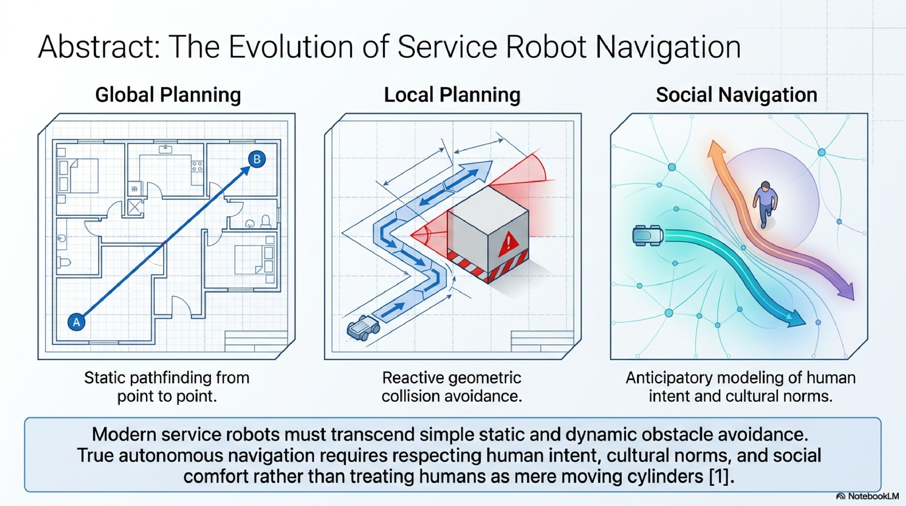

# Social Navigation: Human-Centric Path Planning and Avoidance
**Integrating Human Intent and Cultural Norms into Robotic Path Planning**

## Abstract

Modern service robots must transcend simple static and dynamic obstacle avoidance. True autonomous navigation requires respecting human intent, cultural norms, and social comfort rather than treating humans as mere moving cylinders [1]. This repository contains the presentation slides and demonstration materials detailing the evolution from traditional global/local planning to true Social Navigation.

## 1. Introduction: Diagnosing the Navigational Blindspots
We identified four specific scenarios where traditional geometric optimization creates social friction in human environments. Each scenario highlights a critical failure in legacy navigation logic, supported by foundational research:

- **Scenario 1: Late Reaction (Late Sharp Angles)**
  The robot maintains a straight trajectory until mathematically necessary, resulting in startling, abrupt maneuvers.
  *Matched Paper:* Chen et al. (IROS, 2017) - Socially Aware Motion Planning with Deep Reinforcement Learning (criticism of ORCA's myopic logic).

- **Scenario 2: Conversation Disruption (Pass-Between)**
  The robot passes directly between two interacting individuals, severely disrupting their conversation and violating social spaces (O-space).
  *Matched Paper:* Alami et al. (ASAMA, 2006) - Sociable Robot Navigation in Human Environments (defining respect for social spaces).

- **Scenario 3: Cultural Misalignment (Pass-Left)**
  Violating implicit norms like "Keep Right," leading to awkward passes and broken traffic flow. Pure geometry cannot encode these socio-cultural norms.
  *Matched Paper:* Chen et al. (IROS, 2017) - Socially Aware Motion Planning with Deep Reinforcement Learning.

- **Scenario 4: Frozen Robot (Traffic Deadlock)**
  In dense crowds, multiple half-plane constraints intersect to form an empty set, causing the algorithm to calculate no safe speed and default to zero.
  *Matched Paper:* Trautman & Krause (IROS, 2010) - Unfreezing the Robot: Navigation in Dense, Interacting Crowds.

## 2. Related Work: The Algorithmic Audit
We deconstructed the mathematical architectures of existing legacy systems to understand their systemic bottlenecks:

- **Velocity Obstacle (VO)**
  *Foundation Paper:* Fiorini & Shiller (ICRA, 1998)
  *Drawbacks:* Non-reciprocity leads to severe oscillation in symmetrical encounters. Highly sensitive to sensor noise, causing erratic movements [11, 12].

- **Optimal Reciprocal Collision Avoidance (ORCA)**
  *Foundation Paper:* van den Berg et al. (2011)
  *Drawbacks:* The Heterogeneity Problem—humans do not follow mathematical reciprocity (50/50 split), breaching mathematical safety constraints [17, 18].

- **Collision Avoidance with DRL (CADRL)**
  *Foundation Papers:* Chen et al. (ICRA/IROS, 2017)
  *Drawbacks:* Severe scalability issues in dense crowds due to fixed input vector sizes (information loss). Fails to model complex human-human interactions [23, 24].

## 3. Approach: The Attention-Enhanced Solution
While CADRL successfully encodes social norms, **Dense Crowd Scalability & Interaction** remains the final unsolved frontier (The Algorithmic Gap).

To solve this, we propose an **Attention-Enhanced CADRL**:
- **Core Proposal:** Integrate an Attention mechanism into the CADRL framework to solve the fundamental scalability and dense crowd interaction gaps [25].
- **Mechanism of Action:** Attention dynamically weights the importance of all surrounding agents without fixed input limits. It proactively identifies critical human-human pairs, completely bypassing the fixed-input information loss bottleneck.

## Contents (資料清單)
The repository includes the following core materials:

1. **`Attention_Enhanced_Social_Navigation.pdf`** 
   - A comprehensive slide deck exploring the conceptual framework, diagnostic symptoms, comparative algorithmic audits, and the proposed Attention-Enhanced CADRL solution.
2. **`Socially_Aware_Robot_Navigation.mp4`** 
   - A video demonstration showcasing the trained robot agent navigating dynamically and safely in human environments, illustrating the successful integration of social awareness.

---
**Repository Owner:** [light810311](https://github.com/light810311)
