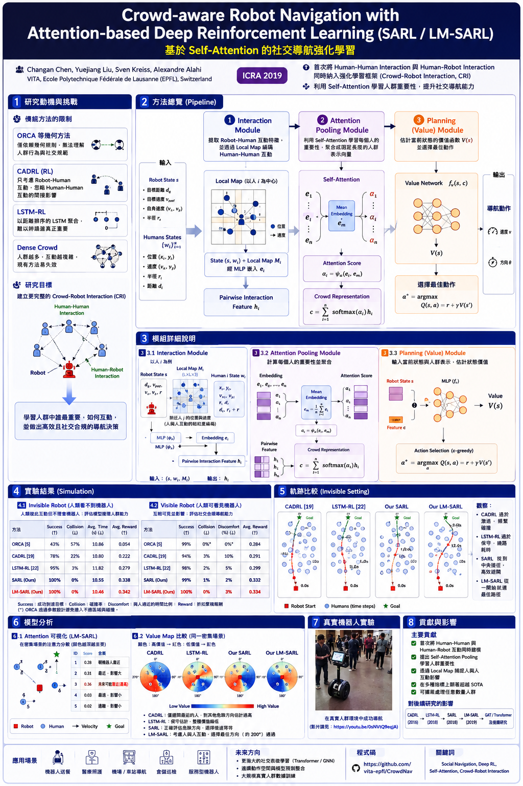

# 社交導航避障 (Human-Centric Path Planning and Avoidance)
> **從幾何限制到全域注意力的演進與突破**
>
> 報告人：邱建彰、粘肇帳

[](https://github.com/light810311/RL-Project)
[](https://github.com/light810311/RL-Project)

---

## 摘要 (Abstract)
現代服務型機器人導航已逐漸從靜態規劃，演進至動態避障，乃至於當前的**意圖感知社交導航 (Social Navigation)**。傳統導航演算法往往將人類視為單純的移動障礙物（幾何圓柱體），忽略了人類的社交空間、隱形舒適圈及互動意圖，導致避障決策過於唐突或在密集人群中陷入「機器人凍結」死鎖。

本專案基於 **OM-SARL (全域注意力機制與局部地圖融合之社交避障演算法)**，結合了狀態互動編碼與動態注意力權重分配機制，能同時建模「人-機」與「人-人」之間的多重互動，引導機器人在密集人群中計算出最具社交禮儀、平滑且安全的導航軌跡。



---

## 1. 傳統機器人導航的三大盲區 (Navigational Blindspots)
在社交場域中，傳統幾何優化或簡單避障法常引發以下問題：
1. **晚期反應 (Late Reaction / Late Sharp Angles)**
   * **現象**：機器人維持原速直到即將發生數學碰撞，才突兀地急轉彎，造成行人驚嚇。
   * **來源文獻**：Chen et al., IROS 2017
2. **破壞社交連結 (Conversation Disruption / Pass-Between)**
   * **現象**：無視行人之間的社交空間（如交談中的 O-space），強行穿梭於人群交談區之間。
   * **來源文獻**：Alami et al., ICRA 2006
3. **機器人凍結效應 (Frozen Robot / Traffic Deadlock)**
   * **現象**：在極度擁擠的環境中，因避障演算法無法計算出絕對安全的速度而歸零停滯，反而成為新的障礙物。
   * **來源文獻**：Trautman & Krause, IROS 2010

---

## 2. 演算法演進與瓶頸分析 (Algorithmic Audit)
我們對比並分析了幾何方法與強化學習導航的底層邏輯與限制：

| 演算法分類 | 代表演算法 | 幾何安全 | 互惠動作 | 社交規範感知 | 密集人群擴充性與互動 (最後難題) |
| :--- | :--- | :---: | :---: | :---: | :---: |
| **傳統幾何** | **Velocity Obstacle (VO)** | ✔ | ❌ (產生互惠抖動) | ❌ | ❌ |
| **傳統幾何** | **ORCA** | ✔ | ✔ (假設 50/50 互惠) | ❌ | ❌ |
| **強化學習** | **CADRL** | ✔ | ✔ | ✔ | ❌ (固定輸入向量資訊遺失) |
| **強化學習** | **LSTM-RL** | ✔ | ✔ | ✔ | ⚠️ (無法處理無序行人狀態) |
| **理想狀態** | **OM-SARL (本架構)** | ✔ | ✔ | ✔ | ✔ (全域注意力動態權重) |

### 核心瓶頸說明：
- **ORCA 的互惠迷思**：假設所有人與機器人均分避障責任（50/50 互惠）。然而，人類在現實世界中並非絕對理性的數學互惠體，一旦假設破滅便極易相撞或凍結。
- **CADRL 與 LSTM-RL 的限制**：CADRL 採用固定輸入維度，在人群密集時會遺失關鍵特徵；LSTM-RL 雖能處理時間序列動態，但對無序（Unordered）的行人狀態組合缺乏有效的空間建模能力。

---

## 3. 本專案核心架構：OM-SARL (Approach)
本專案實現的 **OM-SARL** 核心由三大模組構成，完美克服了無序性與資訊遺失瓶頸：

### A. 互動模組 (Interaction Module)
* **功能**：萃取每位行人 $i$ 與周圍環境的局部網格地圖 $M_i$ 關係。
* **二元互動編碼 $\Phi_e(\cdot)$**：
  * **輸入維度 (60維)**：拼接機器人狀態 $S_r$ (5維) + 行人狀態 $S_h$ (7維) + 局部網格地圖 $M_i$ (48維) = 60維。
  * **輸出結果**：經由 MLP 轉換為個體特徵向量 $e_i$ (100維) 與隱藏特徵 $h_i$ (50維)。

### B. 注意力池化模組 (Pooling Module)
* **機制**：動態計算每個行人的「重要性權重 $\alpha_i$」，克服固定輸入與無序組合限制。
* **全域特徵凝聚**：利用 Softmax 歸一化權重後，對 $h_i$ 進行加權求和：
  $$c = \sum_{i=1}^{N} \alpha_i h_i$$
  輸出無損的「全域社交特徵向量 $c$」 (固定的 50 維)。

### C. 規劃模組與雙階段訓練 (Planning & Training)
* **價值網路 (Value Network)**：輸入機器人狀態 $s$ (5維)與全域特徵 $c$ (50維)，通過 MLP 隱藏層 (150, 100, 100) 預估狀態價值 $V(s)$。
* **雙階段訓練策略**：
  1. **階段一：模仿學習 (Imitation Learning)**：透過模仿專家 (ORCA) 軌跡，死記硬背基礎避障行為。
  2. **階段二：強化學習 (Reinforcement Learning)**：利用社交 Reward Function 在環境中微調策略，學習更符合人類禮儀的絲滑避障。

---

## 4. 實驗設計與評估結果 (Experiments)

### 實驗環境設定
- **硬體資源**：RTX 3070TI (GPU), Intel i7-10700 (CPU), PyTorch
- **資料集**：訓練集 >2000局、驗證集 1000局、測試集 1000局
- **RL 訓練回合**：3000 次模仿學習 + 10000 次 RL 強化學習
- **場景設計**：圓形徑向布局（包含 5 名隨機行人，機器人對行人不可見）。

### 500 局標準測試最終評估表
| 評估模型 | 成功率 | 碰撞率 | 平均導航時間 (s) | 社交危險平均距離 (m) | 訓練時間成本 |
| :--- | :---: | :---: | :---: | :---: | :--- |
| **ORCA** | 43.0% | 57.0% | 10.86s | 0.08m | - |
| **CADRL** | 90.0% | 8.0% | 11.27s | 0.13m | 14小時14分 |
| **LSTM-RL** | 98.0% | 1.0% | 11.95s | 0.11m | 21小時38分 |
| **OM-SARL (本專案)** | **100.0%** | **0.0%** | **10.57s** | **0.16m** | **26小時25分** |

> 📌 **核心洞察**：OM-SARL 雖然因複雜的注意力矩陣運算使訓練時間增加了 85%（達到 26.4 小時），但換來了 **100% 的避障成功率**、**最短的平均導航時間 (10.57s)**，並將安全距離拉大到 **0.16m**，完美兼顧安全與社交規範。

---

## 5. 空間感知與避障軌跡診斷 (Visual Diagnostics)
- **空間風險感知 (Spatial Risk Heatmap)**：
  - *CADRL*：顏色發散，無法鎖定特定威脅。
  - *LSTM-RL*：空間感知均勻保守，缺乏明確的突圍方向。
  - *OM-SARL*：精準鎖定高風險區塊（如 120°~150° 的威脅），計算出最佳突圍向量。
- **避障軌跡對比 (Trajectory Diagnostics)**：
  - *ORCA*：在中心處發生死鎖與迎面碰撞。
  - *CADRL*：軌跡呈鋸齒狀，非最佳路徑。
  - *LSTM-RL*：極度保守，在原地繞行（繞遠路）。
  - *OM-SARL*：提早解讀行人意圖，不干擾對話，展現絲滑的避障路徑。

---

## 6. 未來技術藍圖 (Future Tech Roadmap)
1. **逆向強化學習 (IRL)**：擺脫人工設定 Reward 權重的繁瑣，自軌跡中學習出更具泛化性的回饋機制。
2. **引入連續擴散模型 (Diffusion Models)**：取代離散動作空間，輸出連續且更加平滑的 Actor 控制信號。
3. **注意力機制結構優化 (Attention Optimization)**：精簡矩陣運算，降低高昂的訓練時間成本。

---

## 核心資源 (Resources)
1. **`Global_Attention_Social_Navigation.pdf`**：完整的簡報檔，詳細介紹了社交導航的理論背景、架構與實驗分析。
2. **`Global_Attention_Social_Navigation.pptx`**：原始簡報投影片。
3. **`Global_Attention_Social_Navigation.png`**：專案架構與演進預覽圖。

---

## Installation & Setup

### 1. Install Python-RVO2 Library
The codebase uses the RVO2 library for simulating human agent collision avoidance. The library files are included in the `Python-RVO2` directory.

### 2. Install crowd_sim and crowd_nav
Run the following command in the root directory to install the environment and training packages:
```bash
pip install -e .
```

### 3. Training a Policy
To train a policy (e.g. SARL):
```bash
cd crowd_nav
python train.py --policy sarl
```

### 4. Testing and Evaluation
To evaluate a policy (e.g. ORCA or SARL) with 500 test cases:
```bash
python test.py --policy orca --phase test
python test.py --policy sarl --model_dir data/output --phase test
```

### 5. Visualizing Trajectories
To run a policy for a single episode and visualize the result:
```bash
python test.py --policy orca --phase test --visualize --test_case 0
python test.py --policy sarl --model_dir data/output --phase test --visualize --test_case 0
```

### 6. Plotting Training Curves
To plot the training curve from a log file:
```bash
python utils/plot.py data/output/output.log
```

---
**Repository Owner:** [light810311](https://github.com/light810311/RL-Project)
